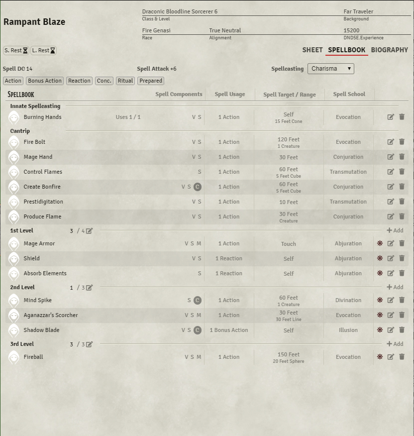

# D&D 5e OGL Character Sheet


[](https://ko-fi.com/elffriend)

A classic layout for a 5e Character Sheet, heavily inspired by the Official 5e Character Sheet and the Roll20 default 5e Sheet. This sheet is chaotic and packed with information all on one screen, but it does have the advantage of having some muscle memory if you're coming from either pen and paper or Roll20.

## Installation

Module JSON:

```
https://github.com/ElfFriend-DnD/foundryvtt-5eOGLCharacterSheet/releases/latest/download/module.json
```

## Gallery


[</img>](readme-img/main-top.png)
[</img>](readme-img/main-bottom.png)
[</img>](readme-img/spellbook.png)
[</img>](readme-img/biography.png)

Click to view bigger.

## Key Features & Changes

### Actions Area
Dead center of the screen this is the place where all of the "combat-important" (damage-dealing) spells and items live. Option in settings to limit spells to only Cantrips.

### Foundry-style Spellbook
It's not as familiar for a Roll20 user, but believe me when I say it's improved in almost every way.

## Options

| **Name**                      | Description                                                                                     |
| ----------------------------- | ----------------------------------------------------------------------------------------------- |
| **Limit Actions to Cantrips** | Instead of showing all spells that deal damage in the Actions panel, limit it to only cantrips. |

This sheet respects the 5e System setting: "Disable Experience Tracking"

### Compatibility

I'm honestly not sure how well this will play with modules that affect character sheets, I'll try to test as many as possible but if somethign is obviously breaking please create and issue here and I'll see what I can do.

| **Name**                                                                                         |       Works        | Notes                                                                                            |
| ------------------------------------------------------------------------------------------------ | :----------------: | ------------------------------------------------------------------------------------------------ |
| [Better Rolls 5e](https://github.com/RedReign/FoundryVTT-BetterRolls5e)                          |        :x:         | Have not successfully integrated yet.                                                            |
| [Midi-QOL](https://gitlab.com/tposney/midi-qol)                                                  | :heavy_check_mark: | Works out of the box for roll replacement, Inventory item buttons don't seem to append correctly |
| [Minor QOL](https://gitlab.com/tposney/minor-qol)                                                |         --         | Deprecated in favor of Midi-QOL. Won't support.                                                  |
| [5e-Sheet Resources Plus](https://github.com/ardittristan/5eSheet-resourcesPlus)                 | :heavy_check_mark: | It's not pretty but it does work.                                                                |
| [Variant Encumbrance](https://github.com/VanirDev/VariantEncumbrance)                            |        :x:         | Default encumberance bar removed, Speed css overrides will break things.                         |
| [FoundryVTT Magic Items](https://gitlab.com/riccisi/foundryvtt-magic-items)                      |        :x:         | Have not successfully integrated yet.                                                            |
| [D&D5e Dark Mode](https://github.com/Stryxin/dnd5edark-foundryvtt)                               | :heavy_check_mark: | Respects foundry-wide dark mode and is "usable."                                                 |
| [Favourite Item Tab](https://github.com/syl3r86/favtab)                                          | :heavy_check_mark: | Inventory overhauls make this particular module a wierd one to use here.                         |
| [Inventory+](https://github.com/syl3r86/inventory-plus)                                          |        :x:         | Inventory overhaul removed the "Inventory" Tab                                                   |
| [Illandril's Character Sheet Lockdown](https://github.com/illandril/FoundryVTT-sheet5e-lockdown) |        :x:         | Doesn't seem to work with any sheet but the 5e stock sheet.                                      |
| [Crash's 5e Downtime Tracking](https://github.com/crash1115/5e-training)                         | :heavy_check_mark: | Works well.                                                                                      |

## Known Issues

- The To Hit/Save DC column is probably going to respond poorly to unconventional weapon builds. Stuff like the Hexblade or Bladesinger.
- The inventory section is very tight, and some items with uses or charges will probably display wierd.

## Acknowledgements

Obviously almost all of the layout decisions here are pretty directly ripped from the Roll20 OGL Character Sheet, and by proxy the WOTC official 5e Sheet.

Shares a lot of code with my own [Compact DnDBeyond-like 5e Character Sheet](https://github.com/ElfFriend-DnD/foundryvtt-compactBeyond5eSheet). If you like D&D Beyond's layout but want it more compact and foundry-fied, check it out.

Yoinked some expanded Biography tab code directly from [tidy5e-sheet](https://github.com/sdenec/tidy5e-sheet). Also took their localization of the headers in said tab.

Bootstrapped with Nick East's [create-foundry-project](https://gitlab.com/foundry-projects/foundry-pc/create-foundry-project).

Mad props to the [League of Extraordinary FoundryVTT Developers](https://forums.forge-vtt.com/c/package-development/11) community which helped me figure out a lot.
